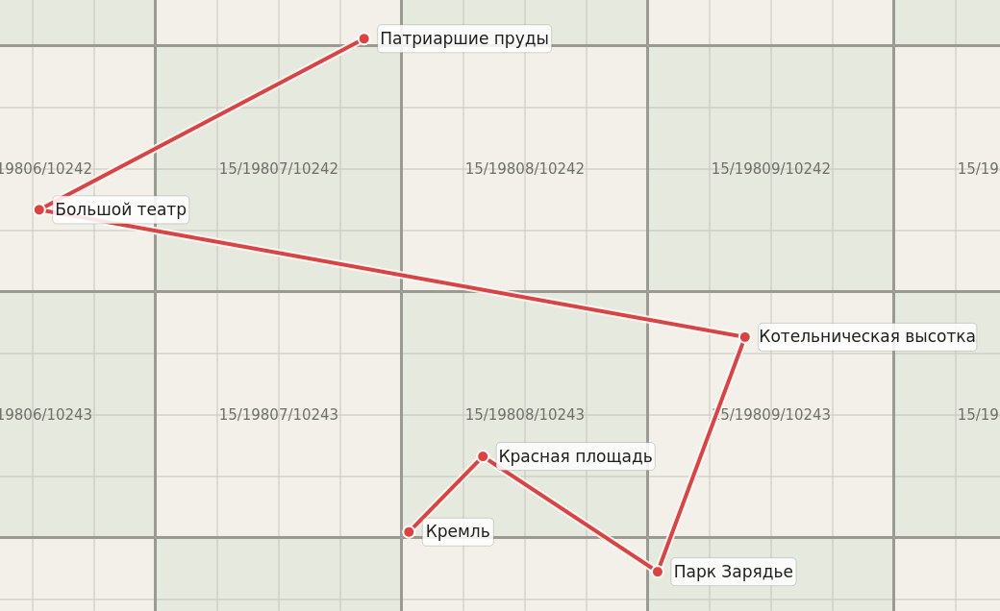

# jopa6 — route renderer over offline map tiles

Renders a list of named geographic points as a **connected, labelled route**
drawn on top of **pre-downloaded map tiles** (the standard `{z}/{x}/{y}.png`
"slippy map" layout used by OpenStreetMap, MapTiler, etc.).

The rendering logic is a self-contained, reusable Qt/C++ module
(`TileMapRenderer`) so it can be embedded into a larger program; a small
command-line tool (`mapgen`) is included for standalone use and testing.



## Requirements

- C++17 compiler
- CMake >= 3.16
- Qt5 **Gui** module (`qtbase5-dev`) — no Widgets needed

```bash
sudo apt-get install -y build-essential cmake qtbase5-dev
```

## Build

The project ships both **qmake** and **CMake** build files; use whichever
matches your host project.

### qmake

```bash
qmake mapgen.pro && make          # the CLI
qmake gentiles.pro && make        # the test-tile helper
```

### CMake

```bash
cmake -S . -B build
cmake --build build -j
```

Either way you get:

| Target / binary | What it is                                                        |
|-----------------|-------------------------------------------------------------------|
| `tilemap`       | The embeddable `TileMapRenderer` module (see `tilemap.pri`).      |
| `mapgen`        | CLI: read points from a file, render to an image.                 |
| `gentiles`      | Test helper that synthesises tiles (CMake: `-DBUILD_TESTING=ON`, default on). |

## Integrating into a qmake project

The renderer is exposed as a qmake **project include** (`tilemap.pri`). From
your application's `.pro`, just include it:

```pro
include(/path/to/jopa6/tilemap.pri)
```

That adds the `TileMapRenderer` sources and headers, puts `src/` on the
include path and pulls in `QT += gui`. The `.pri` intentionally leaves out the
CLI-only parts (`main.cpp`, `pointsio.*`) — your program builds a `GeoPath`
itself and calls `TileMapRenderer::render()` directly (see the module example
below). No extra build steps, no separate library to link.

## Tile layout

Tiles are expected at `<root>/<z>/<x>/<y>.png`, the XYZ/OSM convention where
the Y axis grows from north (top) to south (bottom) — i.e. `…/10242.png` sits
*above* `…/10243.png`. If your cache uses the TMS convention (Y from the
bottom up) pass `--tms`. Tile size and image extension are auto-detected from
a sample tile (falling back to 256×256 / `.png`), and missing tiles are simply
left as background instead of failing the render.

## CLI usage

```bash
# Auto-select the most detailed zoom present on disk:
./build/mapgen --tiles /path/to/tiles --points route.json --out route.png

# Pin a zoom level, TMS tiles, JPEG output:
./build/mapgen -t /path/to/tiles -p route.csv -z 15 --tms -o route.jpg --quality 90
```

Key options (`--help` for the full list): `-t/--tiles`, `-p/--points`,
`-o/--out`, `-z/--zoom` (`-1` = auto), `--tms`, `--tile-size`, `--margin`,
`--max-size`, `--lat-lon` (CSV column order), `--quality`.

> On a headless machine, run under the offscreen platform:
> `QT_QPA_PLATFORM=offscreen ./build/mapgen ...`

## Input formats

The CLI picks a parser by file extension:

- **CSV** (`.csv`, `.txt`) — `lon,lat,name` per line (use `--lat-lon` to swap
  the first two columns). Blank lines, `#` comments and a header row are
  ignored.
- **JSON** (`.json`) — an array of `{ "lon": .., "lat": .., "name": ".." }`
  (aliases `lng`/`longitude`, `latitude` accepted), or `[lon, lat, name]`
  tuples.
- **GeoJSON** (`.geojson`) — a `FeatureCollection` of `Point` features; the
  label is read from `properties.name` / `.title` / `.label`.

See `examples/points.json` and `examples/points.csv`.

## Using the renderer as a module

The library takes points directly — no files involved:

```cpp
#include "tilemaprenderer.h"

GeoPath route = {
    { 37.6175, 55.7520, QStringLiteral("Кремль") },
    { 37.6208, 55.7539, QStringLiteral("Красная площадь") },
};

RenderOptions opt;
opt.tilesRoot = QStringLiteral("/path/to/tiles");
opt.zoom = -1;                 // auto

TileMapRenderer renderer;
renderer.setOptions(opt);
// renderer.setStyle(...);     // optional: colours, line width, fonts, labels

QImage image;
RenderResult r = renderer.render(route, &image);
if (r.ok)
    image.save(QStringLiteral("route.png"));
else
    qWarning() << r.error;
```

`RenderStyle` exposes the line (colour/width/halo), markers, labels (font,
colours, overlap avoidance) and the background fill for missing tiles.
`RenderResult` reports the chosen zoom, image size and how many tiles/points
were drawn or skipped — handy for logging.

> A `QGuiApplication` must exist before calling `render()` (QPainter text
> rendering needs the platform font stack). In a GUI host this is already the
> case; `mapgen` creates one itself.

## How it works

1. Project every point to Web-Mercator **global pixel** coordinates at the
   chosen zoom (`src/mercator.h`).
2. Lay out labels (with greedy overlap avoidance) and compute the content
   bounding box, so nothing is clipped.
3. Composite the tiles intersecting that box, then draw the route line (with a
   contrasting halo), the markers, and the label pills.

## Project layout

```
tilemap.pri           # qmake include for embedding the module in a host .pro
mapgen.pro            # qmake build of the CLI
gentiles.pro          # qmake build of the test-tile helper
CMakeLists.txt        # CMake build (all three targets)
src/
  geopoint.h          # GeoPoint / GeoPath data types
  mercator.h          # Web-Mercator / slippy-map projection math (header-only)
  tilemaprenderer.*   # TileMapRenderer — the reusable module
  pointsio.*          # CSV/JSON/GeoJSON loading (CLI only)
  main.cpp            # mapgen command-line tool
tests/
  gen_test_tiles.cpp  # synthetic tile generator for end-to-end testing
examples/             # sample point files
```

## Testing without a real tile cache

```bash
QT_QPA_PLATFORM=offscreen ./build/gentiles -p examples/points.json -o /tmp/tiles -z 15
QT_QPA_PLATFORM=offscreen ./build/mapgen   -p examples/points.json -t /tmp/tiles -o /tmp/route.png
```
